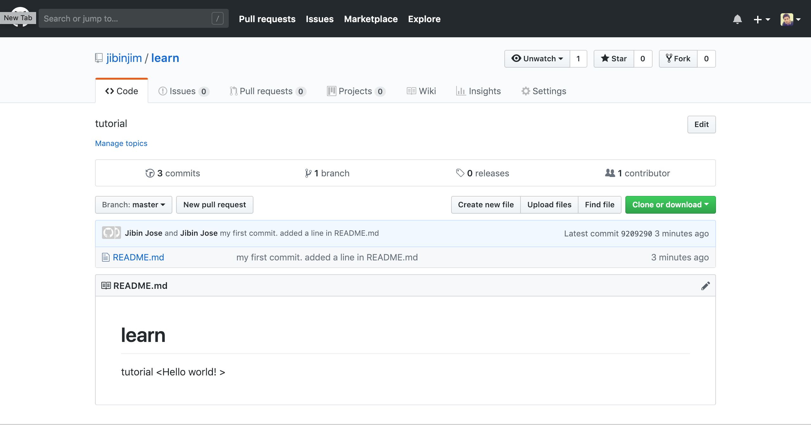

# Setting up git & github account

* Head to [github.com](https://www.github.com) and create your account. 
* Once you've created the account, you should see a dashboard like this. 


* Click  "Your profile" from the menu. 


* Go to "repositories" 


* You can see a list of your repos here. Since you'll be setting this for the first time, click on new to add a repo. 


* Give a repo name - think of it as a folder name in your pc
* Add description \(optional\)
* Check whether you'd like your repo public or private. For this tutorial, we are going to make a public repo. 
* Check the "Initialize this repository with a README" 
* Click on "Create repository" 


 

* You've successfully created your first repo. We have a file called README already in the repo. Now we'll look to have something added to the file and commit it to the repo. 
* Before that, you need to setup git in your pc.

## Setting up git

* Click [here](https://git-scm.com/downloads) to go to the git download page. Choose your platform \(Mac, Windows/ Linux\) and click download. 
* Once the file is downloaded, install the program.


* Open terminal\(mac, linux\)/ command prompt \(windows\) - In mac, search for "terminal" \| Windows user - "**Start** &gt;&gt; Program Files &gt;&gt; Accessories &gt;&gt; Command Prompt"  
* Use the command below to check your git version and to make sure that it has been successfully installed. 

```text
git --version
```


Here you can see my git version in "_versions 2.20.1_" \(may vary from yours but that's fine\). 

* Now you are ready to use git in your pc

## Cloning github repo to your pc

> Think of cloning as copying a folder from your github account \(cloud\) to your pc \(local file\). Now the difference is, whatever change you make on you local pc flies can be selectively added to the cloud version using commit and push \(more on that later\). The advantage is that you don't need to overwrite the entire file to reflect a small change. Also other people can collaborate to make changes.

* Let's create a local folder in your pc and call it "tutorial" . I have created mine in the "documents" folder - I suggest you do the same to easily follow the rest of instructions. 
* Now open terminal and use the command below to navigate to the tutorials folder 

```text
cd Documents/tutorial/
```


* Go to your repos in github profile 


* Click on clone or download and select "Use HTTPS". 


* Copy the https link highlighted. 
* Use the "git clone" command to clone the learn folder to your tutorial folder in pc. 

```text
git clone <your repo link>
```


* If everything's right you'll see something like above. You should now see a new folder named "learn" inside the tutorial folder. You have successfully cloned your learn repo to the tutorial folder. 


* You can also see the README file inside the learn folder. 


* Now to make our first commit \(change the local file and upload to cloud\), open the README file in a text editor. 
* Add a new line. 
* Save the file. 


* Use the command line to navigate to our learn folder 

```text
cd learn
```

Now to add the changes \(stage\) use the command below.  - The "." indicates that all the changes to be added to the commit. 

```text
git add .
```


* Now we are about to commit the changes. 
* use the command below : The text inside " " indicate the commit message for easy understanding of the changes made and easy housekeeping for later. 

```text
git commit -m "my first commit. added a line in README.md" 
```


Note : You'll need to input your username and password for the push to happen. 

* Now we need to use the command below to push the commits to the cloud 

```text
git push
```


Congrats! You've successfully pushed your first commit to the github repo. 




